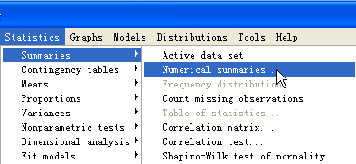
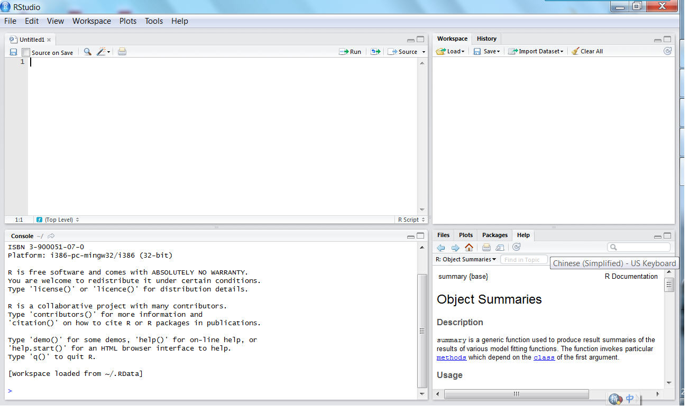

# 熟悉R

关于R的中文入门有很多，在这里不再一一枚举（也不是本册子的职责所在）。但我也不能在这里说，诸位客官回去学完R的基本结构再来吧。一是有点枯燥，二则我个人窃以为学习一个软件最好的办法就是不断的拿例子来磨练，遇到问题去网上搜寻，否则看再多的入门引导也只似过眼烟云，那些命令一会儿就抛到九霄云外了。所以我把会用到的一些东西直接融入在下面这个简单的例子中，有一些必要的说明，希望可以快速的熟悉R。

下面是来自Papke(1995)的一个例子。他研究的是一个退休金计划和计划的慷慨度。

(@401K) 在401K.DTA这个数据集中，我们关心两个变量。prate是在合法的工人中拥有活跃帐户的比例。mrate是用来衡量这个计划的匹配程度（用来代表慷慨度），即如果mrate = 0:5，则表示工人付出了$10，其工作单位相应的付出了$5。接下来，我们需要面对这么几个问题：

    1. 找到prate和mrate这两个变量的平均值。
    2. 对下面这个方程进行最简单的OLS回归：$\hat{prate} = \hat{\beta}_0 + \hat{\beta}_1mrate$，并报告$R^2$。
    3. 找到当mrate = 3.5的时候，prate的预测值。

做计量分析，离不开的就是数据。所以我们第一步先来导入需要的数据。

## 数据的导入

获取数据有很多办法，在R 里面通过*Foreign*包可以读/写Minitab, S, SAS, SPSS, Stata, Systat等等格式的数据。当然，R本身是支持从文本文件（包括CSV格式）和剪贴板中直接读取数据的。此外，对于R包里面自带的数据集，我们可以直接用`data("name")`来加载数据集。这里我采取的是读取Stata的数据（DTA格式）。

当然，我们首先要加载**foreign**包，可以在R中直接点击“加载程序包”，也可以手动输入：


```r
library(foreign)
```


然后就可以使用`read.dta()`命令：


```r
K = read.dta("data/401K.DTA", convert.dates = TRUE, 
    convert.factors = TRUE, missing.type = TRUE, convert.underscore = TRUE, 
    warn.missing.labels = TRUE)
```


```
## Warning message: 'missing.type' only applicable to version >= 8 files
```


```
## Warning message: cannot read factor labels from Stata 5 files
```


```r
summary(K)
```


```
##      prate           mrate          totpart          totelg     
##  Min.   :  3.0   Min.   :0.010   Min.   :   50   Min.   :   51  
##  1st Qu.: 78.0   1st Qu.:0.300   1st Qu.:  156   1st Qu.:  176  
##  Median : 95.7   Median :0.460   Median :  276   Median :  330  
##  Mean   : 87.4   Mean   :0.732   Mean   : 1354   Mean   : 1629  
##  3rd Qu.:100.0   3rd Qu.:0.830   3rd Qu.:  750   3rd Qu.:  890  
##  Max.   :100.0   Max.   :4.910   Max.   :58811   Max.   :70429  
##       age           totemp            sole          ltotemp     
##  Min.   : 4.0   Min.   :    58   Min.   :0.000   Min.   : 4.06  
##  1st Qu.: 7.0   1st Qu.:   261   1st Qu.:0.000   1st Qu.: 5.56  
##  Median : 9.0   Median :   588   Median :0.000   Median : 6.38  
##  Mean   :13.2   Mean   :  3568   Mean   :0.488   Mean   : 6.69  
##  3rd Qu.:18.0   3rd Qu.:  1804   3rd Qu.:1.000   3rd Qu.: 7.50  
##  Max.   :51.0   Max.   :144387   Max.   :1.000   Max.   :11.88  
```


K是我们赋值后在R里使用的数据表的名字。因为R是基于对象(object)的，所以我们需要在读取数据的时候指定数据存储的对象。同样的，后面会不断的用到对象这一概念。

如果觉得这些东西记起来比较麻烦，一个个字母的打起来也挺麻烦的，怎么办？好在有个包叫做**Rcmdr**。加载这个包之后就会出现图形界面，可以通过点击的方式来操作。


## 数据分析

### 平均值
在介绍关于平均值的函数前，先介绍另一个有用的函数`names()`。这个函数的作用是显示数据表中所有的变量名称。用法和效果见后面的代码例子。

我们可以使用`summary()`来获取该数据表的摘要信息，里面包含平均值、最大最小值 、中位数等。不过我们这里只关心两个变量`prate `和`mrate` ，所以也可以使用`numSummary()`（需加载abind包）。


```r
load("data/401K.rda")
names(K)
```


```
## [1] "prate"   "mrate"   "totpart" "totelg"  "age"     "totemp"  "sole"   
## [8] "ltotemp"
```


```r
summary(K)
```


```
##      prate           mrate          totpart          totelg     
##  Min.   :  3.0   Min.   :0.010   Min.   :   50   Min.   :   51  
##  1st Qu.: 78.0   1st Qu.:0.300   1st Qu.:  156   1st Qu.:  176  
##  Median : 95.7   Median :0.460   Median :  276   Median :  330  
##  Mean   : 87.4   Mean   :0.732   Mean   : 1354   Mean   : 1629  
##  3rd Qu.:100.0   3rd Qu.:0.830   3rd Qu.:  750   3rd Qu.:  890  
##  Max.   :100.0   Max.   :4.910   Max.   :58811   Max.   :70429  
##       age           totemp            sole          ltotemp     
##  Min.   : 4.0   Min.   :    58   Min.   :0.000   Min.   : 4.06  
##  1st Qu.: 7.0   1st Qu.:   261   1st Qu.:0.000   1st Qu.: 5.56  
##  Median : 9.0   Median :   588   Median :0.000   Median : 6.38  
##  Mean   :13.2   Mean   :  3568   Mean   :0.488   Mean   : 6.69  
##  3rd Qu.:18.0   3rd Qu.:  1804   3rd Qu.:1.000   3rd Qu.: 7.50  
##  Max.   :51.0   Max.   :144387   Max.   :1.000   Max.   :11.88  
```


可以从上表中读出`prate`和`mrate`的平均值。

`sumSummary()`也可以通过R Commander的图形界面实现。


### 线性回归（普通最小二乘法，OLS）
在R里面进行线性回归还是比较容易的，直接使用`lm()`就可以。值得注意的是，由于R的面向对象特性，我们需要不断的赋值。对于赋值，有三种基本方法，分别可以用“->”“<-”“=”实现，其中前两个是有方向的赋值，所以一般来说更为常用。比如我们可以对变量`mrate`和`prate` 求乘积，并将结果赋予一个新变量`mp`，则只需写成`mp<-mrate*prate`。

因此在做回归的时候写成：


```r
RegModel <- lm(prate ~ mrate, data = K)
summary(RegModel)
```


```
## 
## Call:
## lm(formula = prate ~ mrate, data = K)
## 
## Residuals:
##    Min     1Q Median     3Q    Max 
## -82.30  -8.18   5.18  12.71  16.81 
## 
## Coefficients:
##             Estimate Std. Error t value Pr(>|t|)    
## (Intercept)   83.075      0.563   147.5   <2e-16 ***
## mrate          5.861      0.527    11.1   <2e-16 ***
## ---
## Signif. codes:  0 '***' 0.001 '**' 0.01 '*' 0.05 '.' 0.1 ' ' 1 
## 
## Residual standard error: 16.1 on 1532 degrees of freedom
## Multiple R-squared: 0.0747,	Adjusted R-squared: 0.0741 
## F-statistic:  124 on 1 and 1532 DF,  p-value: <2e-16 
## 
```


这样RegModel里面就存储了这次回归所得的数据。

我们还可以采用`attach()`命令，这样就不用每次都指定回归向量所在的数据集了，直接写`RegModel<- lm(prate~mrate)`，然后就可以用`summary(RegModel)`来看回归的结果了。(注：通常情况下不建议使用`attach()`，可能会导致变量名的一定程度混乱，尤其是在函数封装的时候。)


可以看出估计后的回归方程应为：

$\hat{prate}=83.0755+5.8611mrate$ 

其中$R^{2}$为0.0747。呃，这个$R^{2}$为什么这么小？看看散点图就知道了。

###作回归图像
我们可以直接用最简单的`plot()`命令作图(当然更好的一个选择可能是*[ggplot2][]*)，用法如下：

[ggplot2]: ggplot2       "ggplot2"
 


```r
plot(mrate, prate)
```


```
## Error: object 'mrate' not found
```


```r
abline(RegModel, col = "red")
```


```
## Error: plot.new has not been called yet
```


第二行命令是添加了那条回归拟合线。
可见这个图本来就很散，也难怪线性拟合效果这么差了。

###点预测
最后，就是依赖估计方程做预测了。这里需要的是做一个点预测。R里面需要依据另一个数据集来预测，而且这个数据集中必须含有mrate 这个变量。新建一个数据集并赋值的办法有许多，最简单的就是直接赋值，方法如下：


```r
mrate_new <- data.frame(mrate = 3.5)
```


另外一种不推荐的方式是，利用数据编辑框来手动输入:`mrate_new <- edit(as.data.frame(NULL))`。不推荐的原因是难以有效的追溯数据的来源和数值，尤其是违背“可重复的研究”精神。

之后再利用`predict()`就可得到所需的预测值了。


```r
mrate_new <- data.frame(mrate = 3.5)
predict(RegModel, mrate_new)
```


```
##     1 
## 103.6 
```


###多元线性回归
当然现实中我们很少做一元的线性回归，解释变量往往是两个或者更多。这可以依旧用上面的`lm()`。如下面这个例子，研究的是出勤率和ACT测试成绩、学习成绩之间的关系。

(@ATTEND)  
在ATTEND.DTA这个数据集中，atndrte 是出勤率（采用百分比表示），ACT 为ACT测试的成绩，priGPA 是之前的学习平均分。我们需要估计如下的方程：

$atndrte=\beta_{0}+\beta_{1}priGPA+\beta_{2}ACT+u $

很显然，这里我们和上面的例子一样，代码和结果如下：


```r
library(foreign)
Attend <- read.dta("data/attend.dta", convert.dates = TRUE, convert.factors = TRUE, 
    missing.type = FALSE, convert.underscore = TRUE, warn.missing.labels = TRUE)
Reg2 <- lm(atndrte ~ priGPA + ACT, data = Attend)
summary(Reg2)
```


```
## 
## Call:
## lm(formula = atndrte ~ priGPA + ACT, data = Attend)
## 
## Residuals:
##    Min     1Q Median     3Q    Max 
## -65.37  -6.77   2.12   9.63  29.61 
## 
## Coefficients:
##             Estimate Std. Error t value Pr(>|t|)    
## (Intercept)   75.700      3.884    19.5   <2e-16 ***
## priGPA        17.261      1.083    15.9   <2e-16 ***
## ACT           -1.717      0.169   -10.2   <2e-16 ***
## ---
## Signif. codes:  0 '***' 0.001 '**' 0.01 '*' 0.05 '.' 0.1 ' ' 1 
## 
## Residual standard error: 14.4 on 677 degrees of freedom
## Multiple R-squared: 0.291,	Adjusted R-squared: 0.288 
## F-statistic:  139 on 2 and 677 DF,  p-value: <2e-16 
## 
```


###保存和编辑代码

虽然我们有 *RCommander* 创造的图形界面，但是每次都指定参数也是件很烦的事儿。因此养成一个好习惯，保存好上次运行的代码，下次直接在R里面调用就可以了，有什么修改的也只需要稍作调整即可。*RCommander*里面本身就有`File -> Save Script`，可以把Script Window里面所有代码存储为\*\*\*.R的格式，从而方便下次调用。Script Window里面也是可以直接编辑代码的，删掉一些自己不想要的，调整个别的参数都是很方便的。

需要说明的是，.R文件就是告诉R应该怎么运行的文件，所以可以直接用文本编辑器软件打开并编辑。现在NotePad++, UltraEdit等等文本编辑软件都有支持R的插件，可以方便的把代码传送到R里面调用。R的基本界面中也是可以直接打开.R的脚本文件运行的。此外，推荐一个新兴的R编辑器——RStuidio，集成了R的各种窗口（<red>将在后续章节详述</red>）。

##寻求帮助

有了上述的例子，相信大家已经基本熟悉R了。那么遇到问题怎么办呢？比如`summary()`这个函数，对于不同的模型会有不同的用法，那么我们就需要去查看原始的帮助。在R中，最简单的办法就算再想要查看的命令前加一个“?”号。例如`?summary`之后就会蹦出来帮助页面了。这是查看某一包作者撰写原始文档的最快捷方式。此外也可以用两个连续的问号“??”来搜索所有相关的资料。

但是如果根本不知道有哪些命令，则需要去找包内原始的资料。可以直接在Google等搜索引擎里面搜寻，也可以查看R包自带的说明，亦可以参照各种书籍。总之方法很多，多多利用互联网是最好的办法。国内最佳的地方自然是[统计之都论坛的R版](http://cos.name/cn/ "统计之都论坛的R版")，里面有丰富的资料和资深的UseR为大家解惑。

下面，我们将介绍一些R的基础知识，包括软件的安装、配置和基本的数据清理工作，为后续的分析打下坚实的基础（曾经某位自身的数据分析专家说过，“在数据正式进入模型之前，最关键的就是*数据整理*”。这一步可能会耗费很多时间，但把数据整理为理想的格式会为后面的统计分析提供极大的便利）。

基础数据整理与分析
==================

软件安装
--------

### R核心

R可以从[www.r-project.org](http://www.r-project.org)下载，里面点击CRAN后可以选择CHINA的几个镜像，然后依据操作系统选择对应的版本即可。

### R的IDE编辑器
安装完R之后，最好再选择一个顺手的编辑器，用于书写对应的R代码。这里推荐的是RStudio，可以从[rstudio.org](http://rstudio.org/)下载。安装完成后，双击打开，界面如图[fig:RStudio]所示。

[fig:RStudio]RStudio界面



RStudio界面，分为四块。左上角是脚本编辑框和数据浏览框；右上角是当前空间中数据情况和使用命令的历史记录；左下角是实际的R的代码执行界面和相应返回的结果；右下角是文件目录列表、画图展示区、R包目录区和帮助区。

### 安装R包

目前我们的工作仅仅搭好了R的架子，还需要依据分析任务下载并安装对应的R包。这部分内容在后续中会详细依据案例介绍。

数据的导入
----------

### 指定工作目录

在R中，默认的工作目录依系统配置而变化，可以在直接启动R之后，通过`getwd()`命令来查看。

```{r set-working-directory}
getwd() 


另外，如果是通过后缀名为.R的脚本文件来直接调用R，那么工作目录就为该脚本文件所在的目录。如果对于任何命令的参数等希望得到进一步的说明，那么可以在命令前加上“?”来直接调用帮助。比如，

```{r help} 
?getwd


这个时候R会弹出帮助文档窗口。

在我们撰写R脚本之前，往往希望事前指定一个工作目录，这个时候就可以利用`setwd(file_path)`.

R里面大多数操作都是面向对象的，所以上述代码的含义就是给`file_path`这个object赋上了`` "E:/example/" ``这个文本串作为其值。然后利用`setwd()`函数来指定工作目录。显然，这个代码和直接调用`` setwd("E:/example/") ``是等同的。

### 加载分析包

R作为一个开源软件，最大的特性就是有很多人在不断的贡献各种分析包，从基础的数据整理到高级的统计模型、可视化实现都有着相应的支持。R里面现在可以支持分析包括但不仅限于：

-   Bayesian： Bayesian Inference（贝叶斯推断）

-   ChemPhys：Chemometrics and Computational Physics（化学计量和计算物理）

-   ClinicalTrials：Clinical Trial Design, Monitoring, and Analysis（临床试验设计、监测和分析）

-   Cluster：Cluster Analysis & Finite Mixture Models（聚类分析和有限混合模型）

-   Distributions： Probability Distributions（概率分布）

-   Econometrics： Computational Econometrics（计量经济学）

-   Environmetrics： Analysis of Ecological and Environmental Data（生态和环境学数据分析）

-   ExperimentalDesign： Design of Experiments (DoE) & Analysis of Experimental Data（实验设计和分析）

-   Finance：Empirical Finance（实证金融分析）

-   Genetics：Statistical Genetics（统计遗传学）

-   Graphics：Graphic Displays & Dynamic Graphics & Graphic Devices & Visualization（图形显示、动态图形、图形设备和可视化）

-   HighPerformanceComputing： High-Performance and Parallel Computing with R（高性能并行计算）

-   MachineLearning：Machine Learning & Statistical Learning（机器学习和统计学习）

-   MedicalImaging：Medical Image Analysis（医学图像分析）

-   Multivariate：Multivariate Statistics（多元统计）

-   NaturalLanguageProcessing：Natural Language Processing（自然语言处理）

-   OfficialStatistics：Official Statistics & Survey Methodology（官方统计和普查方法）

-   Optimization：Optimization and Mathematical Programming（最优化和数学规划）

-   Pharmacokinetics：Analysis of Pharmacokinetic Data（药代动力学数据分析）

-   Phylogenetics：Phylogenetics, Especially Comparative Methods（系统发育、特别是比较方法）

-   Psychometrics：Psychometric Models and Methods（心理测量模型和方法）

-   ReproducibleResearch：Reproducible Research（可重复的研究）

-   Robust：Robust Statistical Methods（稳健性统计模型）

-   SocialSciences：Statistics for the Social Sciences（社会科学统计）

-   Spatial：Analysis of Spatial Data（空间数据分析）

-   Survival：Survival Analysis（生存分析）

-   TimeSeries：Time Series Analysis（时间序列分析）

-   gR：gRaphical Models in R（图形模型）

每一项的具体说明请参见：[http://cran.r-project.org/web/views/](http://cran.r-project.org/web/views/)。

针对每一项任务，我们往往都需要加载不同的包。在第一次加载一个包以前，我们往往需要先安装。在Rstudio界面中，加载包的命令位于`Tools -> Install Packages`，然后可以输入包的名字来安装，如图[install packages]所示。

[install packages]安装包（在Rstudio中）


安装完包之后，可以直接通过`library()`命令加载。如我们常用的`data.table`这个包：

```{r library}
library(data.table) 


注意：**R里面严格区分大小写**，所以大小写不对的话包是无法加载成功的。

###订阅某个主题下的R包及其更新
[CRAN下的Task Views](http://cran.r-project.org/web/views/)不仅仅罗列了各个主题下的R包情况，其本身亦作为一个R包*ctv*出现。在R中安装这个包之后，可以很方便的安装所有主题下的包。比如，我们希望安装Econometrics这个主题下所有提及的包，那么:

```{r install-packages-via-ctv}
install.packages("ctv")
library("ctv")
install.views("Econometrics") #安装Econometrics主题下的包
update.views("Econometrics") #更新Econometrics主题下的包


对于刚刚接触R的用户来说，这样一次性下载并安装一系列R包，可以省去调用某些包时候需要现下载、安装的等待时间，也方便测试某些代码和函数。

数据来源
--------

### 文本格式

文本为最常见的数据存储格式，包括以`.txt`、`.csv`、`.tsv`等一系列扩展名结尾的文件。文本文件可以通过windows自带的记事本或者Notepad++、UltraEdit等文本编辑软件直接打开。

在R中，文本文件的读取依赖`read.table()`等一类命令，使用`?read.table`可以看到，里面可以指定很多参数，其中常用的有`file，header， sep ，quote`等。

-   file：需要读入的文件名

-   header: 第一列是否为变量名

-   sep: 变量之间的分隔符

-   quote: 文本被包裹的符号

比如在当前工作目录下，我们有一个制表符（Tab或`\t`）分割的文本文件`sample.txt`，第一行含有英文变量名（中文变量名可能会出错，依系统而异），然后文本没有被任何符号包裹，那么我们读入它的时候需要采用：

```{r read-text-files}
sample <- read.table("data/sample.txt",header=TRUE, sep="")


而`read.csv()`、`read.csv2()`、`read.delim()`、`read.delim2()`都是`read.table()`不同默认参数的变形：

> `` read.csv(file, header = TRUE, sep = `",`", quote=`"\`"`", dec=`".`", fill = TRUE, comment.char=`"`", ...) ``
>
> `` read.csv2(file, header = TRUE, sep = `";`", quote=`"\`"`", dec=`",`", fill = TRUE, comment.char=`"`", ...) ``
>
> `` read.delim(file, header = TRUE, sep = `"\t`", quote=`"\`"`", dec=`".`", fill = TRUE, comment.char=`"`", ...) ``
>
> `` read.delim2(file, header = TRUE, sep = `"\t`", quote=`"\`"`", dec=`",`", fill = TRUE, comment.char=`"`", ...) ``

当数据不整齐的时候，R会在读入过程中报错，并给出出错的行数。当然我们也可以通过更改参数来强制读入。`read.table()`的常用参数定义如下：

- `header`：是否把第一行读为变量名

- `sep`：列与列之间的分隔符

- `quote`：引号的格式

- `col.names`：可以指定一个文本向量，作为变量的名字，其中所含名字的个数需与列数相一致

- `colClasses`：可以为每一列指定格式，如果不需要读入的话置为NULL即可。

- `fill`：是否强制每一行都有相同的列数

其他的参数如`as.is`、`na.strings`等，可参见`?read.table`的说明。

### Excel 格式：通过ODBC接口

Excel格式除了可以采用excel里面导出文本文件或者csv文件的方式外，还可以采取`ODBC`方式读入(Windows和Mac下)。如果采用这种方式，需要加载*RODBC*这个包。

`library(RODBC)`

`` excel_channel <- odbcConnectExcel(`"data/sample.xls`") ``

`` sample_excel <- sqlFetch(excel_channel, `"sample`") #参数为要导入的excel数据表的名字 ``

`odbcClose(channel)`

`` sample_excel_2007 <- odbcConnectExcel2007(`"data/sample.xlsx`") #对于07版excel文件 ``

当然，除了excel之外，所有基于ODBC接口的数据都可以读入，包括常见的MySQL、Access等。在Linux下，MySQL数据库建议使用另外的`RMySQL`包连接。

### Excel 格式：通过*xlsx*包

除了ODBC之外，另一种简单的方式则是调用*xlsx*包（在linux平台下也可运行）。该包不仅仅可以读入excel数据，还可以“将Excel读取为数据框，以及将数据框写入为Excel文件都不是问题，而更加强大的是它能处理Excel中的格式，比如合并单元格，设置列的宽度，设置字体和颜色等等”（具体请参见[yixuan的介绍](http://yixuan.cos.name/cn/2012/01/new-method-to-read-excel-file-in-r/)）。这样，就为通过R脚本重复生成excel格式的报表等铺平了道路。

如果只是读入数据，那么直接调用`read.xlsx()`就可以了。

```{r read-excel-via-xlsx}
library(xlsx)
file <- system.file("tests", "test_import.xlsx", package = "xlsx")
sample_sheet1 <- read.xlsx(file, 1) # 读取第一个工作表


对于该包中`write.xlsx()`等写入excel文件函数感兴趣的读者，可以借助`?write.xlsx`来阅读详细的使用说明。注：该包只支持excel 07以上格式，对于`.xls`格式还请先用高版本的Excel等软件进行转换。

### 数据库（SQL）

其他数据库可以通过对应的包连接 <待补充>

### 其他数据格式

大多数常见的数据都可以通过*foreign*这个包读入：

-   SPSS： `read.spss()`

-   Minitab：`read.mtp()`

-   SAS：`read.ssd()`或者`read.xport()`

-   Stata：`read.dta()`

变量操作
========

变量重命名
----------

导入数据之后，可以在RStudio的右上方Workspace那里看到一个新的数据，名为sample，共有针对17个变量的99行记录。单击可以在左上角的数据浏览窗内看到对应的数据样本。

这个时候，可以用`names()`来查看变量名：

```{r names-of-variables}
names(sample) 


而后，可以对变量进行重新命名：

比如，我们想把第二个字段重命名为RECORD_DAY：

```{r rename-variables}
names(sample)[2] <- "RECORD_DAY" 

这里把`names(sample)`返回的第二个元素重新定义为了RECORD_DAY，故而实现了变量的重命名。

或者，我们希望对导入的没有变量名的数据集进行重命名（一般这种情况下对应的默认变量名是V1、V2等），那么可以直接对整个数据集操作。

```{r rename-all-variables}
names(sample) <- c("CUSTOMER","RECORD_DAY","LOCATION","LOCATION2","FROM","NOTE","BOOK_ID","NOTE2","BOOK_TYPE","CLASS_ID","CLASS_NAME","AMOUNT","LENGTH","LENGTH2","PAGES","PAGES2","BOOK_NAME")


data.frame的行、列操作
----------------------

在一个data.frame中，我们可以直接用$来调用其中的一个变量，是最简单的调用列的格式。如果希望调用某些行列，则需要分别指定调用条件，比如：

```{r data-frame}
sub_sample <- sample["BOOK_ID"==348368158,c("CUSTOMER,"RECORD_DAY","BOOK_ID")] 


那么sub_sample里面现在就得到了购买过编号为348368158这本书的所有顾客购买记录，包括顾客ID、购买日期和书籍ID。即，对于任何一个data.frame对象，都可以在中括号内，逗号之前指定行选择条件，逗号之后指定要选择的列（变量）。`c()`为向量生成函数。

数据格式的转换
--------------

-   vector, data.frame , matrix, list

    对于各种数据集，一般读入之后默认的是data.frame格式。此外我们常用的还有向量格式vector、矩阵格式matrix、混合格式list等。简单的说，一个data.frame的一列就是一个vector，比如我们需要所有顾客的ID这个向量：

    ```{r vector-selection}
    CUSTOMER_ID <- sample$CUSTOMER
    ````

    这个时候就会在workspace那里出现一个新向量CUSTOMER_ID。各个格式之间可以直接转换，比如

    ```{r data-frame-transform}
    CUSTOMER_ID <- as.data.frame(CUSTOMER_ID)
    ````

    那么这个时候customer_ID就成为了只有一个变量的data.frame格式了。

-   logic, character, integer, numeric, factor

    对于向量中的元素，记录的格式则可能是逻辑型、文本型、整数型、数值型、因素型等等。各个向量格式之间可以直接转换，比如对于CLASS_ID这个变量，虽然是数值记录的但数值本身没有任何意义，只是一个相互区别和识别的代码，因此可以考虑专为character或者factor格式：

    ```{r as-factor}
    sample$CLASS_ID <- as.factor(sample$CLASS_ID)
    ````

    之后R里面就会识别其为文本或者因素型数据了。值得注意的是，如果需要把一个因素型的数据重新转换为整数型，则需要经过文本型过渡：

    ```{r as-integer}
    sample$CLASS_ID <- as.character(sample$CLASS_ID)
    sample$CLASS_ID <- as.integer(sample$CLASS_ID)
    ````

    否则会被直接重编码，丢失原有的数据串信息[^1]。

[^1]: 花开两朵、各表一枝：实际上，我们也可以应用这种特性来进行重编码工作。

新变量生成
----------

-   逻辑型

    如果我们基于一些记录判断生成新的变量，比如基于如果`用户购买量>0`，则我们认为其在当日有购买行为，那么可以使用：

    ```{r logic-variable}
    sample$purchase <- sample$AMOUNT > 0
    ````

    这样就生成了一个新的逻辑型变量purchase（取值为TRUE  或者FALSE）。逻辑型变量的一大用处就是可以直接通过相乘操作来进行多个行为之间的交集运算，比如除了是否购买之外，我们还关心购买的书籍是不是在标号为200的书店购买的，那么就可以：

    ```{r logic-variable-2}
	sample$book_store_200 <- sample$LOCATION == 200
	sample$purchase_bs200 <- sample$book_store_200*sample$purchase
	````

    最后得到的变量purchase_bs200为TRUE则该用户是在200号书店购买的图书。类似的，我们可以统计是不是每个月都有购买行为等。

    这里还一并介绍一个有用的`%in%`运算符，表示一个元素是否属于一个给定的集合，比如：

    ```{r in-operation}
	sample$book_store <- sample$LOCATION %in% c(200,300)
	````

    表示用户在200或者300号书店进行了购买。`c()`为向量生成函数，故得到的向量含有200和300两个元素。

-   数值型

    数值型变量的操作一般就是基本的运算，R里面的话，

    -   +：加法

    -   -：减法

    -   *：乘法

    -   /：除法

    -   %% ：取余

    -   ^n ：n次方

-   字符操作

    字符操作最常见的就是字符串生成操作，比如我们有CUSTOMER、LOCATION、和BOOK_NAME三个变量，希望批量生成一个变量，然后发送给顾客作为反馈记录，希望的格式为“CUSTOMER顾客您好，您在编号为LOCATION的书店购买了书籍BOOK_NAME，仅供确认。”，那么我们可以使用paste()这个函数：

    ```{r character-operation}
	sample$message <- paste(sample$CUSTOMER,"顾客您好，您在编号为",sample$LOCATION,"的书店购买了书籍",sample$BOOK_NAME,"，仅供确认。",sep="")
    ````
    这个时候就得到的相应的新变量。`paste()`函数有个参数是`sep`，用来指定各个部分之间的连接符，默认为空格，如果不需要任何额外的符号用一对双引号设置为空即可。

    字符的其他操作亦包括查找、截取`substr()`等。

数据集合并操作
--------------

-   列合并：对于两个含有完全一样变量的数据集，可以采用` rbind() `函数来直接将一个data.frame附加在另外一个后面。

-   行合并：如果两个数据集有相同的记录数（行数），那么可以采用`cbind() `这个函数来直接把变量附加在后面。

-   数据集合并：`merge()`函数提供了更强大的数据集合并操作命令，可以按照一个主键（即用来识别个体的变量）来合并，比如我们另有一个文件
    BOOK_MAP.txt，里面记录的是重编码后的书籍ID和原编码对照表，则可以读入之后利用来`merge()`合并：

    ```{r merge-operation}
	book_map <- read.delim("data/BOOK_MAP.txt", header= T)
	sample_merged <- merge(sample,book_map, by.x="BOOK_ID", by.y="BOOK_ID", all.x=T, all.y=F)
	````

	这样就有了一列新的变量，记录的是重编码之后的书籍ID。

-   删除/提取变量

    如果要删除某个变量，可以直接使用NULL值置空，即：

    ```{r delete-variable}
	sample_merged$CLASS_NAME <- NULL
    ````

    会删除掉` CLASS_NAME`这个变量。在需要删除多个变量的时候，不如只保留几个变量，如：

    ```{r reserve-variable}
	sample_merged <- sample_merged[,c("BOOK_ID","CLASS_ID")]
    ````
    会只保留`BOOK_ID`, `CLASS_ID` 两个变量。
	
数据集形状的转换（reshape2包）
---------------
除了这些基本的变量操作之外，还有一类可能的需求就是对于整个数据集做一个形状的转换，比如把“长数据集”转换为“宽数据集”。这样的过程类似于“揉面”，而帮我们玩转面团的利器便是*reshape2*这个包。

在正式介绍强大的*reshape2*包之前，需要先提到一个轻量级武器——`reshape()`函数。这个函数可以帮我们在数据的长、宽形状之间自由玩转，比如我们现在有一个用户逐月购买记录，为长格式，想把它变为宽格式：

```{r reshape-example}
load("data/reshape_sample.rdata") #载入样本数据集
summary(reshape_sample) #基本统计量，有CUSTOMER_ID（顾客ID）、MONTH（月份）、PURCHASE（消费额）三个变量
head(reshape_sample) #调用数据的前几行，显示为长格式
reshape_sample_wide <- reshape(reshape_sample, idvar="CUSTOMER_ID", timevar="MONTH", direction="wide") #变为宽格式
head(reshape_sample_wide)  #宽格式展现
summary(reshape_sample_wide) #宽格式下基本统计量


在*reshape2*包中，`melt()`函数进一步简化了这个过程。比如我们现在希望把宽数据转回长数据：

```{r melt-example}
reshape_sample_long <- melt(reshape_sample_wide, id=c("CUSTOMER_ID")) #转回长数据格式
head(reshape_sample_long[order(reshape_sample_long$CUSTOMER_ID),]) #长格式展示


此外，该包提供的`acast()`/`dcast()`函数可以进一步帮我们分类展现数据及其统计量，具体使用请参见函数包内帮助。

数据的导出
==========

数据导出最常用的应该就是`write.table`函数。比如我们要输出book_map这个数据集为文本格式，那么使用：

```{r output-table}
write.table(book_map, file="book_map_new.txt", row.names=F, col.names=T, sep="\t", quote=F)


这个时候就会得到book_map_new.txt这个文本文件，以制表符分隔。`write.table()`的主要参数有：

-   file：指定文件名

-   row.names：是否输出记录行编号

-   col.names：是否输出变量名

-   sep：分隔符

-   quote：引号形式

-   append：是否附加在现有文件后面（如为FALSE则新文件覆盖原有文件）

分类统计（*data.table*包）
======================

日常分析工作中，最常用到的就是分类统计了。简单的说，就是按一个字段归类之后，统计其他字段的量。

比如，我们现在希望知道每个顾客购买的图书的总数。那么可以使用如下的代码：

```{r data-table-sum}
library(data.table)
sample_stat <- data.table(sample)
sample_stat <- sample_stat[,list(Amount=sum(AMOUNT),Book=length(unique(BOOK_ID))),by="CUSTOMER"]
sample_stat


这样在新的对象sample_stat里面，就有了每个顾客购买书籍的总本书、以及不同图书的数量。简单的说，需要使用这样的分类统计的时候，就是先加载`data.table`这个包，然后利用`data.table()`函数转换一个data.frame为data.table格式，然后在原有的data.frame行、列操作基础上，增加了一个by参数，可以用来指定分类的依据。当然这里我们可以同时针对多个变量及其组合分类统计，比如

```{r data-table-by-group}
library(data.table)
sample_stat_by_day <- data.table(sample)
sample_stat_by_day <- sample_stat_by_day[,list(Amount=sum(AMOUNT),Book=length(unique(BOOK_ID))),                       by=c("CUSTOMER","RECORD_DAY")]
sample_stat


这样返回的就是逐日统计的每位顾客的购买数量了。值得多说的是，`sum()`函数代表求和，`length()`函数代表计数，而`unique()`函数则是去掉重复值。

循环和判断
==========

我们常用的循环和判断有三种：

-   for

-   while

-   if

循环和判断是基本的逻辑操作语句。在R中，大部分常用功能都已经有现成的函数，所以极少用到循环，我们也非常不提倡在R里面写循环（效率一般很低，因为一个循环背后往往是现有函数内部的许多层循环）。有的时候，为了一些特殊的情况，知道怎么写循环还是有用的。比如，我们希望把统计好的顾客购买记录按照顾客ID写入不同的文本文件，这里就需要用到for循环或者while循环。

```{r loops}
for (i in 1:nrow(sample_stat)) 
{file_name <- paste("data/result_",sample_stat[i,]$CUSTOMER,"_record.txt",sep="")  
write.table(sample_stat[i,],file=file_name,sep="\t",row.names=F, col.names=T, quote= F)    
}


这里用到了for循环。另，`nrow()`是用来统计一个data.frame行数的函数，同样的`ncol()`会返回其列数。符号:会生成一个向量，从1到`nrow(sample_stat)`。常用的循环还有while，同时可以使用if来进行一些判断。这里不再赘述。

